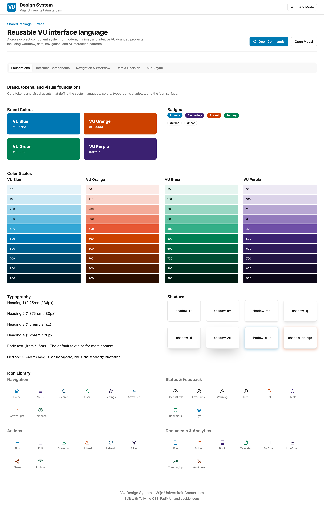
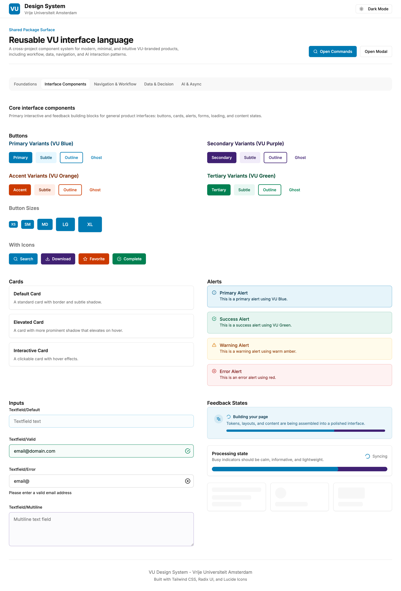
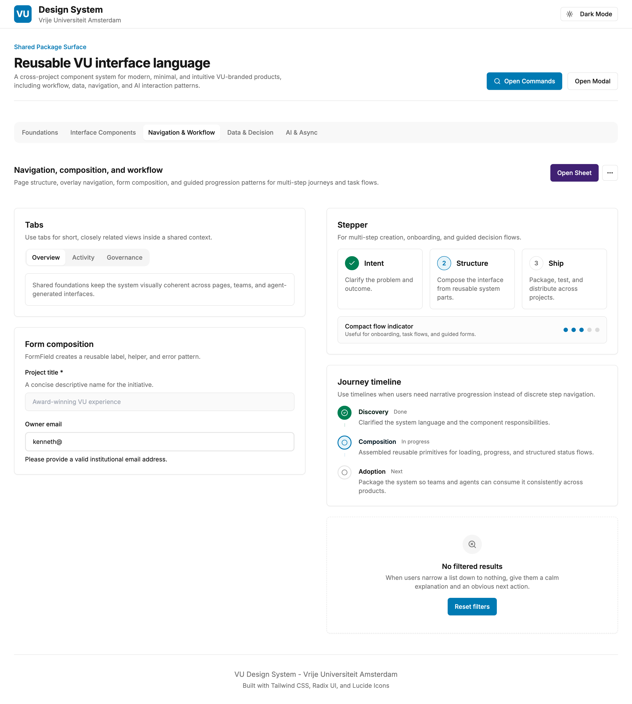
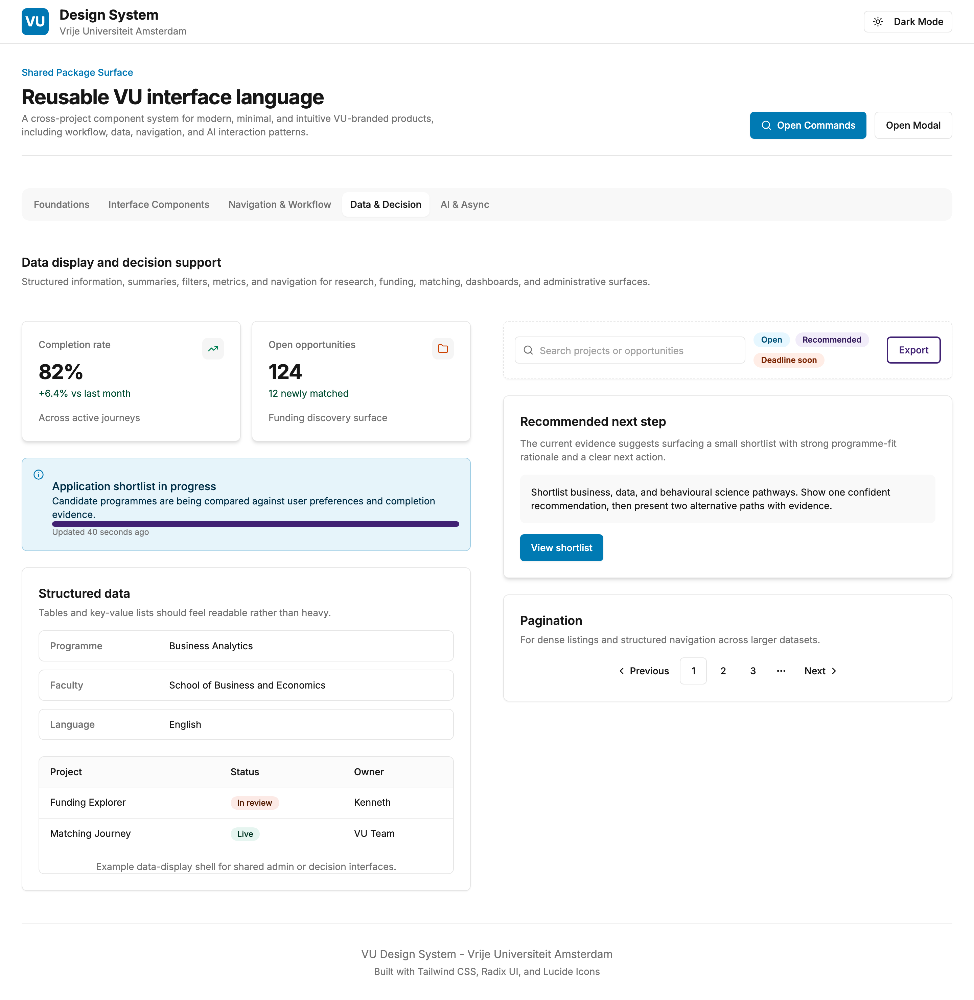
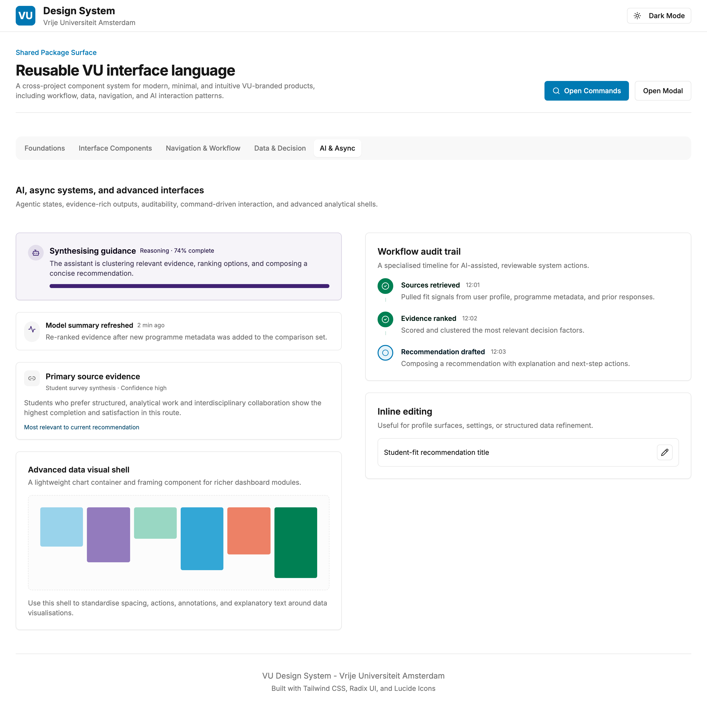

# VU Design System

A shared UI foundation for VU-branded web projects.

## Purpose

This project defines reusable design tokens, icons, and component primitives for building consistent, accessible, high-quality interfaces across projects.

## Setup

```bash
npm install
```

Or start in one step:

```bash
./start.sh
```

## Showcase

Run the interactive showcase to explore all components:

```bash
npm run dev
```

Or use the project wrapper:

```bash
./start.sh
```

### Showcase screenshots

| Foundations | Components | Workflow |
|-------------|------------|----------|
|  |  |  |

| Data | AI & Async |
|------|------------|
|  |  |

## Build the showcase

```bash
npm run build
```

## Installation

### Install from GitHub (public)

```bash
npm install github:kmwandingi/vu-design-system
```

### Local development

Install from local path into any project:

```bash
cd /path/to/your/project
npm install /path/to/vu-design-system
```

Or add to `package.json`:

```json
{
  "dependencies": {
    "@vu/design-system": "file:/path/to/vu-design-system"
  }
}
```

Then run:

```bash
npm install
```

### Build the library (when making changes)

```bash
cd /path/to/vu-design-system
npm run build:lib
```

This compiles TypeScript to `dist/` and prepares the package for consumption.

### Development workflow

When you install via local path, npm creates a **symlink** (not a copy):

```
node_modules/@vu/design-system → ../../vu-design-system
```

This means:
- Edit components in the design system folder
- Run `npm run build:lib` to recompile
- Changes appear **immediately** in consuming projects
- No reinstall needed

Iterate rapidly across all your projects with one build command.

## Dependencies

The package requires these peer dependencies in your consuming project:

```bash
npm install react react-dom tailwindcss lucide-react class-variance-authority clsx tailwind-merge
```

## Shared package usage

Core public entrypoint:

```ts
import {
  Button,
  Alert,
  Card,
  Input,
  Textarea,
  Badge,
  Checkbox,
  CheckboxIndicator,
  CheckboxLabel,
  RadioGroup,
  Radio,
  RadioIndicator,
  RadioLabel,
  Switch,
  Select,
  SelectTrigger,
  SelectValue,
  SelectContent,
  SelectItem,
  FormField,
  EmptyState,
  PageHeader,
  SectionHeader,
  Tabs,
  TabsList,
  TabsTrigger,
  TabsContent,
  Dialog,
  Modal,
  Sheet,
  Drawer,
  DropdownMenu,
  DropdownMenuTrigger,
  DropdownMenuCheckboxItem,
  DropdownMenuRadioItem,
  Progress,
  ProgressDots,
  Stepper,
  Skeleton,
  Spinner,
  Separator,
  LoadingState,
  Timeline,
  StatCard,
  StatusPanel,
  ResultSummary,
  ActivityFeedItem,
  KeyValueList,
  Table,
  useTableSort,
  FilterBar,
  SearchInput,
  Pagination,
  AIState,
  EvidenceCard,
  WorkflowAuditTimeline,
  CommandPalette,
  InlineEditable,
  DataVisualShell,
  Icons,
  InfoHint,
} from '@vu/design-system';
```

Theme preset:

```js
import vuPreset from '@vu/design-system/tailwind.preset';

export default {
  presets: [vuPreset],
};
```

Global styles (import in your app entry):

```ts
import '@vu/design-system/theme.css';
```

## Reusable application patterns

The design system is intentionally not domain-specific. Downstream products should compose their pages from shared patterns rather than recreating local mini-systems.

- `PageHeader` — top-level page framing for task-oriented product views
- `SectionHeader` — supports both standard section headers and compact uppercase utility headings
- `FormField` — supports stacked and inline field layouts, descriptions, errors, and label-side actions
- `LoadingState`, `StatusPanel`, `AIState` — shared async and operational status surfaces
- `StatCard` — supports dashboard cards and compact summary cards with optional inline hints
- `FilterBar` + `SearchInput` — search and filter composition for operational pages
- `EmptyState` — reusable zero-data and no-selection fallback
- `ResultSummary` — structured recommendation and review summary surface with tone variants
- `KeyValueList` — metadata inspection and structured detail display in default or compact layouts
- `InfoHint` — inline tooltip helper for small explanatory affordances

For review panels, comparison cards, and metadata-heavy interfaces, prefer composing these shared pieces with `Card`, `Button`, `Icons`, `Table`, and `Separator` instead of creating domain-locked components.

## Architecture

- `src/components` — reusable component primitives intended for package consumption, including form, feedback, loading, and flow components
- `src/styles/components.ts` — variant definitions and shared styling contracts
- `src/styles/theme.css` — tokens and theme variables
- `src/styles/icons.ts` — curated icon surface
- `src/index.ts` — public package entrypoint
- `src/app/App.tsx` — showcase and validation surface
- `tailwind.preset.js` — reusable Tailwind preset for downstream projects

## System taxonomy

The package is organized conceptually around recurring UI situations observed across funding, matching, learning, and modern AI-assisted interfaces.

- `Foundation`
  - tokens, theme variables, icons, spacing, gradients, surfaces, focus, motion

- `Inputs`
  - `Input`, `Textarea`, `Select`, `Checkbox`, `RadioGroup`, `Switch`, `FormField`, inline editing, search, filter composition

- `Feedback`
  - `Alert`, `Badge`, `Progress`, `Spinner`, `Skeleton`, `LoadingState`, `EmptyState`

- `Navigation`
  - `Tabs`, `Dialog` / `Modal`, `Sheet` / `Drawer`, `DropdownMenu`, `Pagination`, headers

- `Data Display`
  - `Card`, `StatCard`, `KeyValueList`, `Table`, `ResultSummary`, `DataVisualShell`, metadata and inspection layouts

- `Workflow`
  - `Timeline`, `WorkflowAuditTimeline`, `ProgressDots`, `Stepper`, `StatusPanel`

- `AI / Async`
  - `AIState`, `EvidenceCard`, `CommandPalette`, activity and reasoning surfaces

## Recurring product situations covered

- dense forms and validation flows
- page-level structure and section framing
- loading, waiting, syncing, and incremental progress states
- filtered search and exploration surfaces
- dashboards, summaries, and structured decision views
- step-based journeys and process visibility
- agentic / AI-assisted evidence and reasoning patterns

## Contributing

We welcome contributions! If you find a missing primitive, need a new prop, or want to add a feature:

### Reporting Issues

Open an issue on GitHub describing:
- What primitive/prop is missing
- Your use case
- Expected API or behavior

### Adding a Component or Feature

1. **Fork and clone** the repo:
   ```bash
   git clone https://github.com/kmwandingi/vu-design-system.git
   cd vu-design-system
   ```

2. **Create a branch**:
   ```bash
   git checkout -b feat/add-[component-name]
   ```

3. **Add your component** in `src/components/`:
   - Follow existing patterns (see `Button.tsx` or `Checkbox.tsx`)
   - Export from `src/index.ts`
   - Add to breaking-change allowlist in `scripts/check-exports.mjs`

4. **Test the build**:
   ```bash
   npm run build:lib
   ```

5. **Commit and push** (pre-commit hooks run automatically):
   ```bash
   git add .
   git commit -m "feat: add [component] with [features]"
   git push origin feat/add-[component-name]
   ```

6. **Open a Pull Request** on GitHub

### Adding New Exports

When adding new exports, update `scripts/check-exports.mjs`:
```js
const requiredExports = [
  // ... existing exports
  'YourNewComponent',  // Add here
];
```

This ensures the pre-commit hook knows about your new export and won't reject it as an error.

### Design Principles for Contributions

- **Follow The Five Rules** (see skill files)
- **Accessibility first** — WCAG 2.2 AA compliance
- **Composition over configuration** — small primitives that compose
- **No breaking changes** — only add, never remove exports without major version bump
